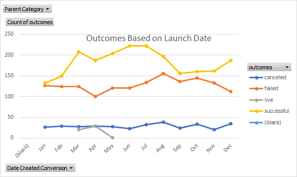

# An Analysis of Kickstarter Campaigns
Performing analysis on Kickstarter data to uncover trends
*Found that campaigns with high, ambitious fundraising goal were not as successful as campaigns with reasonable, realistic fundrasiing goals.
[C:\Users\plant\Documents\Columbia Data Bootcamp\Classwork\Crowdfunding Project/Box_and_Whiskers_Chart.xlxs]
[C:\Users\plant\Documents\Columbia Data Bootcamp\Classwork\Crowdfunding Project/Outcomes_Based_on_Launch_Date]
[C:\Users\plant\Documents\Columbia Data Bootcamp\Classwork\Crowdfunding Project/Parent_Category_Food_Outcomes]

